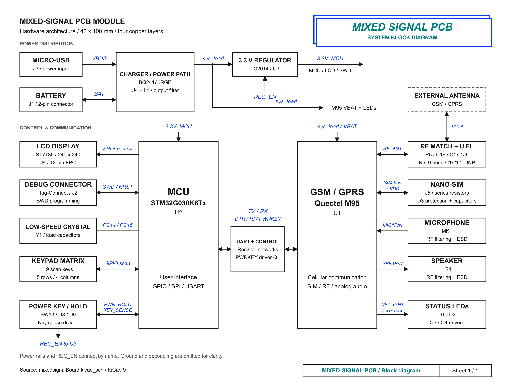
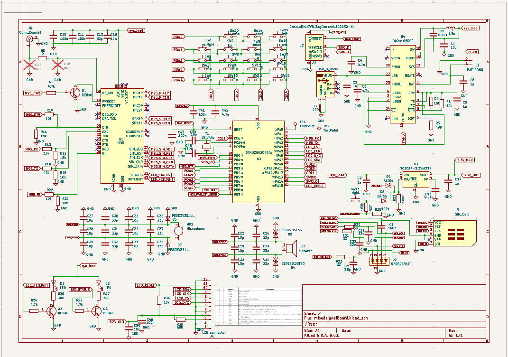
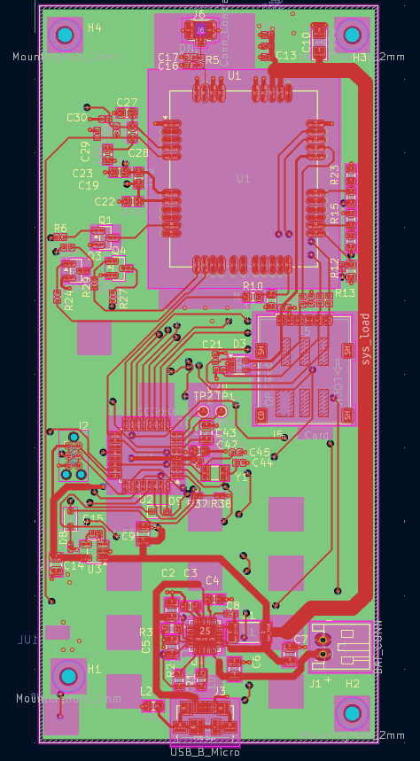
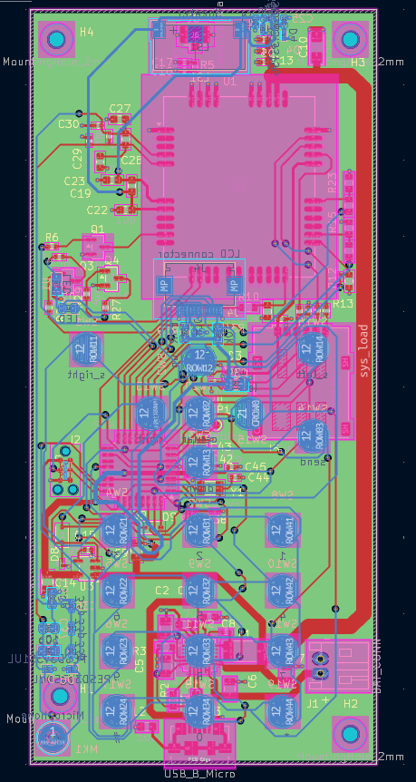
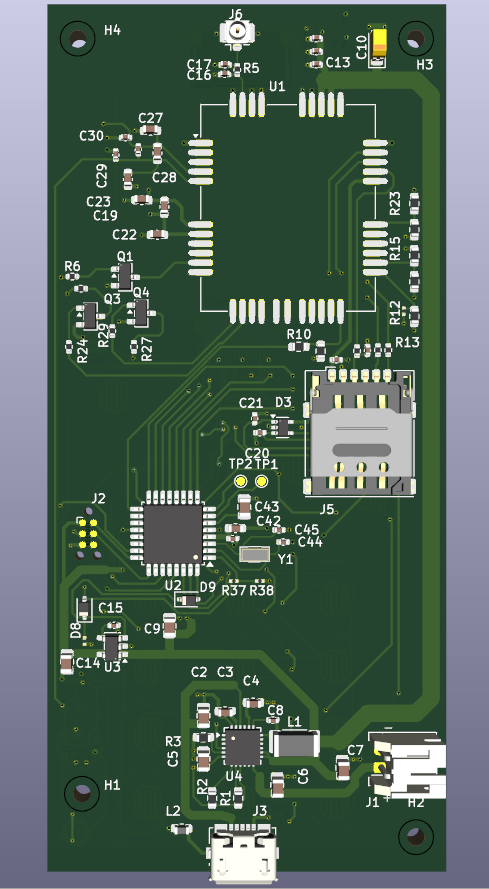
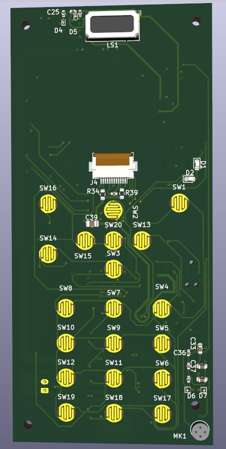
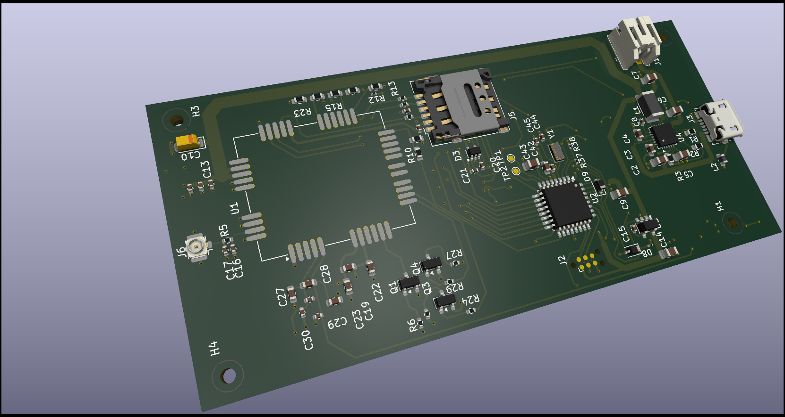
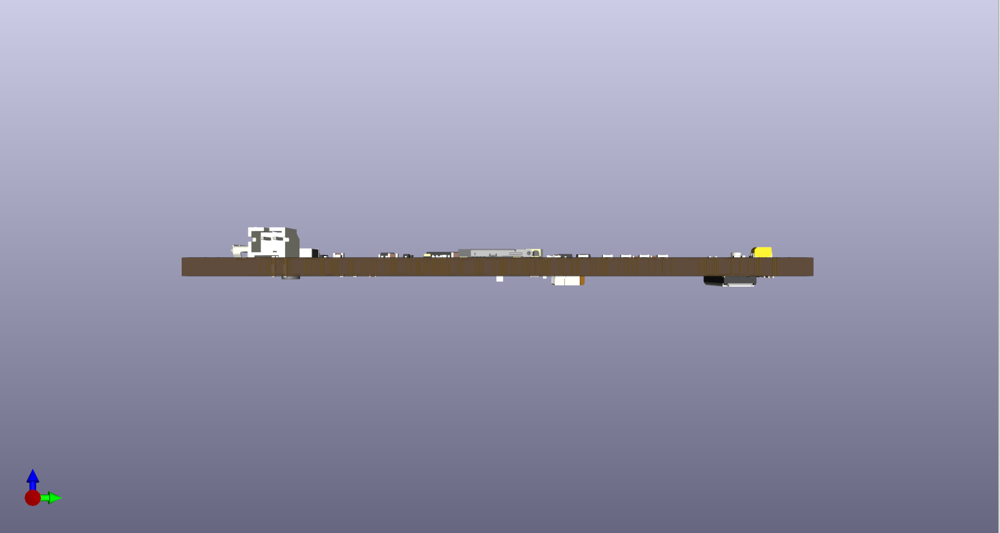

# Mixed-Signal PCB Module

A four-layer KiCad 9 PCB design for a compact GSM/GPRS handheld device. It combines a Quectel M95 cellular module, an STM32 microcontroller, battery charging and regulation, a SIM interface, display connector, keypad, and audio circuitry.

## Design specifications

| Item | Implemented design |
| --- | --- |
| Board outline | 46 x 100 mm |
| Copper layers | 4: `F.Cu`, `In1.Cu`, `In2.Cu`, `B.Cu` |
| Stackup material | FR-4 dielectrics; ENIG finish specified in KiCad |
| Board thickness | 2.9984 mm as currently stored in the PCB file; confirm with the fabricator |
| Cellular module | Quectel M95 GSM/GPRS (`U1`) |
| MCU | STM32G030K6Tx (`U2`) |
| Power | BQ24166RGE charger/power-path IC (`U4`), 3.3 V regulator (`U3`), Micro-USB power input (`J3`), battery connector (`J1`) |
| RF interface | U.FL coaxial connector (`J6`) for an external antenna; 0-ohm series link (`R5`) and DNP shunt matching positions (`C16`, `C17`) |
| Display | 12-position, 0.5 mm-pitch FPC connector (`J4`) for the intended ST7789-based 240 x 240 LCD module |
| SIM | Nano-SIM connector (`J5`) with interface protection |
| User I/O | 20 keypad switches, status LEDs, microphone, speaker |
| Programming/debug | Tag-Connect SWD connector (`J2`); SWO is not connected |
| Mechanical | Four 2 mm mounting-hole footprints |

The Micro-USB connector is used for power; its USB data pins are unconnected in this design. The U.FL connector is **not** an antenna: an appropriate external antenna and cable are required for RF operation.

## Repository files

- `mixedsignalBoard.kicad_pro` - KiCad project settings.
- `mixedsignalBoard.kicad_sch` - circuit schematic.
- `mixedsignalBoard.kicad_pcb` - PCB layout, footprints, routing, and board stackup.

Open `mixedsignalBoard.kicad_pro` with KiCad 9 to inspect the schematic and layout. Firmware, manufacturing exports, assembly files, and a physical antenna are not included in this repository.

## Before fabrication

This is a design project, not a validated hardware product. Check the actual LCD module pinout and connector orientation, antenna matching and 50-ohm RF geometry against the chosen fabricator's stackup, and all component part numbers before ordering. The PCB currently assigns both inner copper zones to `M95_SIM_GND` and records an approximately 3.0 mm stackup; verify that these are intentional and manufacturable. Passing ERC or DRC alone does not establish electrical, RF, or functional performance.

## Design gallery

The views below show the system block diagram, complete schematic, PCB routing, and both sides of the board. The 3D images are KiCad renders, not photographs of fabricated hardware.

### System block diagram

The diagram summarizes power distribution and the connections between the STM32, M95, display, keypad, SIM, RF, and audio circuits.

[High-resolution PNG](images/mixed-signal-block-diagram.png) | [Editable SVG](images/mixed-signal-block-diagram.svg)

### Schematic

### PCB layout

| Front copper view | Multi-layer routing view |
| --- | --- |
|  |  |

### 3D renders

| Component side | Keypad side |
| --- | --- |
|  |  |

| Perspective view | Board edge profile |
| --- | --- |
|  |  |
